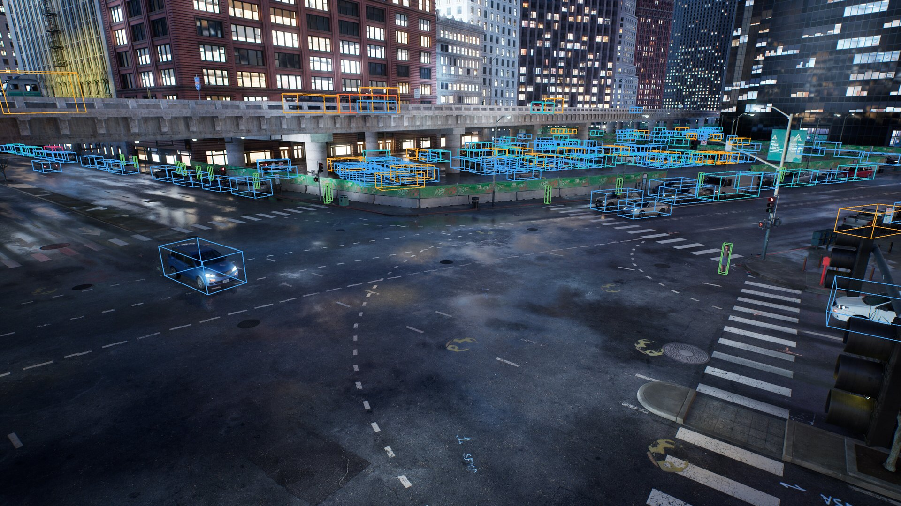
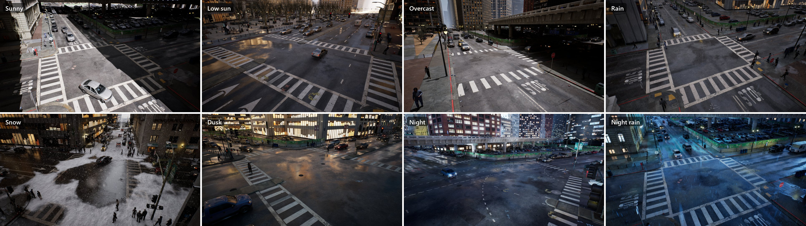
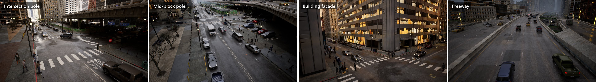
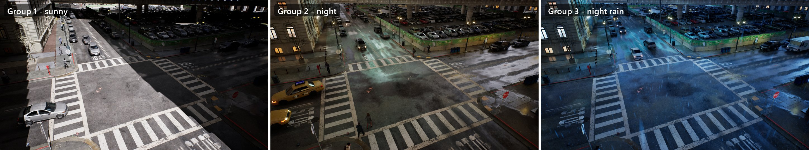
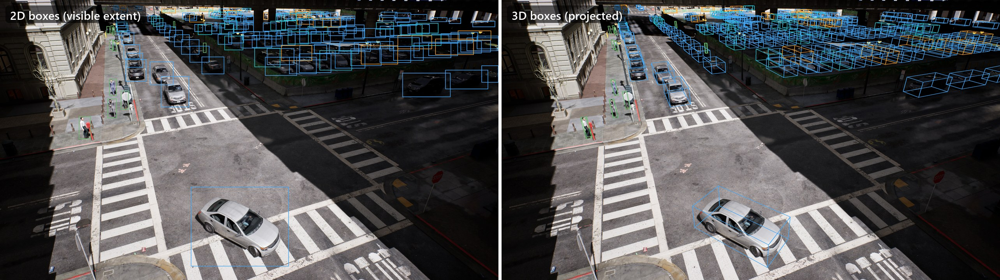
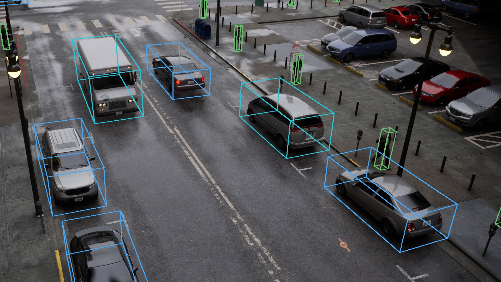

<div align="center">

# Boundless

### Photorealistic Synthetic Data for Object Detection in Urban Streetscapes

[](https://arxiv.org/abs/2409.03022)
[](https://mkturkcan.github.io/boundless/)
[](https://huggingface.co/mehmetkeremturkcan/boundless-simulator)
[](#datasets)
[](https://www.python.org/)
[](LICENSE)

Mehmet Kerem Turkcan, Yuyang Li, Chengbo Zang, Javad Ghaderi, Gil Zussman, Zoran Kostic

[AIDL Lab](https://www.aidl.ee.columbia.edu/), Columbia University



</div>

**Boundless** is a photorealistic synthetic data generation system for highly accurate object detection in dense urban
streetscapes. It replaces massive real-world data collection and manual ground-truth annotation with an automated and
configurable process: infrastructure cameras are placed across a city, time of day, weather and traffic are varied, and
every frame comes with accurate 2D and 3D bounding boxes for all vehicles and pedestrians in view.

Boundless is based on the Unreal Engine 5 City Sample project. Object detectors trained on Boundless data and evaluated on
real-world imagery from medium-altitude cameras outperform detectors trained on CARLA-generated data by **7.8 mAP**.

This repository contains the **Boundless Python API**, the data generation examples used for the released datasets, and
tools for working with the annotations. The simulator itself is distributed as a ready-to-run Windows application.

---

## Highlights

- **Infrastructure cameras, placed automatically.** Camera poses are derived from the road network: traffic-light and
  street-light poles at intersections and mid-block, building facades at 2nd and 3rd floor windows, and freeway
  gantries. Every pose is checked against the scene geometry before use.
- **Complete 3D ground truth.** Oriented 3D boxes for every moving and parked vehicle and every pedestrian, in world,
  camera and image coordinates, together with 2D boxes, truncation, a depth-tested visible fraction, and per-frame
  camera intrinsics and extrinsics. Objects are labeled up to 2 km from the camera.
- **Scene variability.** Sun position, intensity and color temperature, sky, camera exposure and white balance; clear,
  overcast, rain, snowfall, snow cover and fog; day, dusk and night with lit windows and street lights.
- **Live traffic.** Moving traffic, parked vehicles and pedestrians can be re-spawned at any density between shots, so
  consecutive shot groups never share the same parked cars.
- **Up to 4K.** Native-resolution rendering (e.g. 3840x2160) with hardware ray-traced global illumination.
- **Simple Python control.** A dependency-free client drives the simulator over TCP: load maps, place cameras, change
  the scene, and capture images with labels.

## Gallery

<p align="center"></p>
<p align="center"><sub>Sunny, low sun, overcast, rain, snow, dusk, night and night rain.</sub></p>

<p align="center"></p>
<p align="center"><sub>Automatically placed infrastructure cameras: intersection pole, mid-block pole, building facade and freeway.</sub></p>

<p align="center"></p>
<p align="center"><sub>One camera, three shot groups. Each group draws a new condition and re-spawns traffic, parked vehicles and pedestrians.</sub></p>

<p align="center"></p>
<p align="center"><sub>Ground truth for every visible object: 2D boxes of the visible extent (left) and oriented 3D boxes (right).</sub></p>

<p align="center"></p>
<p align="center"><sub>A 1:1 crop of a 3840x2160 frame.</sub></p>

---

## Installation

**1. Simulator.** Download the Boundless simulator for Windows from
[huggingface.co/mehmetkeremturkcan/boundless-simulator](https://huggingface.co/mehmetkeremturkcan/boundless-simulator)
and extract it, e.g. to `C:\Boundless`.

| Requirement | |
|---|---|
| OS | Windows 10 or 11, 64-bit |
| GPU | NVIDIA RTX with hardware ray tracing, 12 GB+ VRAM (RTX 4080 or better recommended for 4K) |
| Memory | 32 GB RAM |
| Disk | SSD recommended; a 10,000-frame 4K dataset needs about 20 GB |

The first launch compiles shaders for your GPU and takes a few minutes longer than later launches.

**2. Python API.**

```bash
git clone https://github.com/mkturkcan/boundless.git
cd boundless
pip install -e .            # the client uses only the Python standard library
pip install pillow numpy    # used by the examples and tools
```

## Quickstart

Start the simulator in API mode:

```bat
C:\Boundless\Boundless.exe -BoundlessMode=api -BoundlessMap=/Game/Map/Small_City_LVL -windowed -ResX=1920 -ResY=1080
```

Then drive it from Python:

```python
from boundless import Client, BoundlessError

with Client("127.0.0.1", 2000) as client:
    client.wait_until_ready()
    client.set_lighting(sun_elevation=35, sun_azimuth=210, sun_intensity_scale=4.0, auto_exposure=True)
    client.set_weather(rain=0.4, fog=0.2)
    client.set_density(traffic=1.2, parked=0.8, crowd=1.0, respawn=True)

    for pose in client.sample_camera_poses(n=20, seed=1, kinds=["intersection"]):
        try:
            shot = client.capture(pose=pose, validate_pose=True, output_dir="C:/data/quickstart")
        except BoundlessError:          # e.g. the pose failed the geometry checks
            continue
        print(shot.image_path, [obj["label"] for obj in shot.objects])
        break
```

`examples/quickstart.py` contains the same as a script.

## Generating a dataset

`examples/collect_dataset.py` is the unattended, resumable generator used for the released datasets. It visits the
city as a tour of *sites* (an intersection and its surroundings). At every site it places up to sixteen distinct
infrastructure cameras and takes several rounds; every round draws a new condition, re-spawns traffic, parked vehicles
and pedestrians at new densities, and captures each camera once. A view is therefore never repeated without a full
re-spawn. Before every capture the generator waits until all agents in view have loaded, and the next site is preloaded
while the current one is captured.

```bash
# The full Boundless Big City 4K dataset: 10,000 frames at 3840x2160 (about 1,500 frames per hour on an RTX 4080)
python examples/collect_dataset.py --out C:/data/boundless_bigcity_4k --target 10000 --launch C:/Boundless/Boundless.exe
python tools/finalize_dataset.py C:/data/boundless_bigcity_4k --title "Boundless Big City 4K"

# Preview the conditions first: two frames of each plus a contact sheet (gallery.jpg)
python examples/collect_dataset.py --out C:/data/preview --gallery 2 --launch C:/Boundless/Boundless.exe

# Small City at 1920x1080 with depth maps
python examples/collect_dataset.py --out C:/data/smallcity --map "Small City" --resolution 1920x1080 --save-depth \
    --launch C:/Boundless/Boundless.exe
```

| Condition | Share | | Condition | Share |
|---|---|---|---|---|
| Sunny | 27% | | Snow (falling and/or lying) | 7% |
| Low sun | 10% | | Dusk | 5% |
| Overcast | 15% | | Night | 16% |
| Rain | 14% | | Night rain | 6% |

The presets are defined in `sample_condition()` and are straightforward to adapt. A run can be stopped at any time and
continues where it left off when started again. Afterwards, `tools/finalize_dataset.py` checks the dataset and writes
statistics, a COCO export, a preview sheet and a README into the dataset folder.

## Annotations

Each frame produces `rgb/NNNNNN.jpg` and `labels/NNNNNN.json`:

```jsonc
{
  "frame": "001335", "map": "Big_City_LVL", "image": "rgb/001335.jpg",
  "camera": {
    "location": [x, y, z], "rotation": [pitch, yaw, roll], "quat_xyzw": [...],
    "fov": 81.28, "width": 3840, "height": 2160,
    "K": [[2237.1, 0, 1920], [0, 2237.1, 1080], [0, 0, 1]],
    "world_to_camera": [[...4x4...]],               // world (m) -> OpenCV camera (x right, y down, z forward; m)
    "pose_kind": "intersection_pole", "pose_id": "intersection_aab12c31"
  },
  "scene": { "lighting": {...}, "weather": {...}, "traffic_density": 0.51, "parked_density": 0.98, "crowd_density": 1.04 },
  "objects": [{
    "id": "mass_148382049105926994",                // stable while the agent exists
    "label": "car",                                 // car, van, truck, bus, trailer, pedestrian, bicycle, motorcycle
    "parked": false,
    "distance_m": 33.26,
    "center": [31334.47, -253787.93, 151.93],       // world, cm
    "extent": [239.44, 105.5, 87.58],               // half size along the box's forward / right / up axes, cm
    "rotation": [0.39, 118.5, 0.9],                 // pitch, yaw, roll (degrees)
    "corners_world":  [[x, y, z], ...],             // 8 corners, cm
    "corners_camera": [[-8.07, -5.86, 34.50], ...], // 8 corners, OpenCV camera frame, m
    "corners_image":  [[1396.55, 700.24], ...],     // 8 corners in pixels (null when behind the camera)
    "bbox_2d": [1237.83, 588.42, 1458.64, 827.44],  // projected 3D box, clipped to the image
    "bbox_2d_visible": [1240, 588.42, 1456, 826],   // extent of the unoccluded part
    "truncation": 0.0,
    "visible_fraction": 1.0,                        // depth-tested share of the object that is visible
    "visible_pixels": 38916,
    "occlusion": 0                                  // 0 visible, 1 partly, 2 largely occluded
  }]
}
```

See [docs/annotations.md](docs/annotations.md) for the full format, coordinate conventions and corner order.

## Tools

| Script | Purpose |
|---|---|
| `tools/visualize_labels.py DATASET` | Draws 2D boxes and projected 3D boxes on frames |
| `tools/to_coco.py DATASET` | COCO detection JSON, keeping the 3D box as extra fields of each annotation |
| `tools/to_yolo.py DATASET` | Ultralytics YOLO layout with `data.yaml`, split by camera so no camera is in both train and val |
| `tools/dataset_stats.py DATASET` | Frame, camera, class, condition, occlusion and box-size statistics |
| `tools/finalize_dataset.py DATASET` | Consistency check, `stats.json`, `coco.json`, `preview.jpg` and a dataset README |

## Python API

| Method | Description |
|---|---|
| `status()`, `wait_until_ready()` | Current map, readiness and session state |
| `list_maps()`, `load_map(name)` | Available maps (`"Small City"`, `"Big City"`) and map loading |
| `set_lighting(...)` | Sun elevation, azimuth, intensity and temperature; sky; `night`; exposure, auto exposure, white balance, saturation, contrast |
| `set_weather(rain, snow, snow_cover, fog)` | Weather around the camera, each 0 to 1 |
| `set_density(traffic, parked, crowd, respawn)` | Agent densities relative to the map defaults; `respawn=True` re-creates all agents |
| `randomize_scene(...)` | Draws lighting, weather and traffic from configurable ranges |
| `sample_camera_poses(n, seed, kinds, rig)` | Infrastructure camera poses of kind `intersection`, `midblock`, `facade` or `freeway` |
| `set_camera(pose)`, `get_camera()`, `validate_pose(pose)` | Camera placement, intrinsics/extrinsics, geometry checks |
| `capture(pose, validate_pose, output_dir, **options)` | Renders one frame with labels; returns paths, labels and the final pose |
| `get_annotations(**options)` | Labels of the current view without rendering an image |
| `readiness()`, `wait_until_settled(timeout, min_seconds)` | Whether all agents in view have loaded; blocks until they have |
| `set_actor_spawn_budget(seconds)` | Per-frame time for spawning agents, so they appear within a few frames after a re-spawn or camera move |
| `stream_site(location, radius, slot)`, `site_ready(slot)` | Keeps an area loaded (and preloads the next one) so cameras can move within it without waiting |
| `console(command)`, `pause()`, `quit()` | Engine console, pausing and shutdown |

The complete reference, including capture options and camera rig parameters, is in [docs/api.md](docs/api.md).

## Datasets

| Dataset | Description | |
|---|---|---|
| **Boundless Big City 4K** | 10,000 frames at 3840x2160 with 2D and 3D boxes | [Hugging Face](https://huggingface.co/datasets/mehmetkeremturkcan/boundless-bigcity-4k) |
| **Boundless I2X** | Top-down intersection views in the [Constellation](https://huggingface.co/datasets/mehmetkeremturkcan/constellation_urban_intersection_dataset) format | [Hugging Face](https://huggingface.co/datasets/mehmetkeremturkcan/boundless-i2x) |

**Boundless Big City 4K** was generated with the first command in [Generating a dataset](#generating-a-dataset).

| | |
|---|---|
| Frames | 10,000 at 3840x2160 |
| Sites / cameras | 211 sites / 3,332 camera poses |
| Objects | 467,619 (47 per frame) |
| Classes | car 257,972 · pedestrian 131,025 · van 43,034 · truck 28,565 · bicycle 5,487 · bus 1,536 |
| Parked (vehicles and bicycles) | 210,762 |
| Conditions | sunny 2,845 · rain 1,540 · night 1,432 · overcast 1,324 · low sun 1,202 · snow 636 · night rain 529 · dusk 492 |
| Box heights | < 32 px 120,585 · 32-96 px 187,240 · > 96 px 159,794 |

## Citation

```bibtex
@article{turkcan2024boundless,
  title   = {Boundless: Generating Photorealistic Synthetic Data for Object Detection in Urban Streetscapes},
  author  = {Turkcan, Mehmet Kerem and Li, Yuyang and Zang, Chengbo and Ghaderi, Javad and Zussman, Gil and Kostic, Zoran},
  journal = {arXiv preprint arXiv:2409.03022},
  year    = {2024}
}
```

## License

The code in this repository is released under the [MIT License](LICENSE). The Boundless simulator is built with Unreal
Engine and is subject to the [Unreal Engine EULA](https://www.unrealengine.com/eula). Unreal and Unreal Engine are
trademarks or registered trademarks of Epic Games, Inc.

## Acknowledgments

Boundless is built on [Unreal Engine 5](https://www.unrealengine.com/) and the City Sample project by Epic Games.
